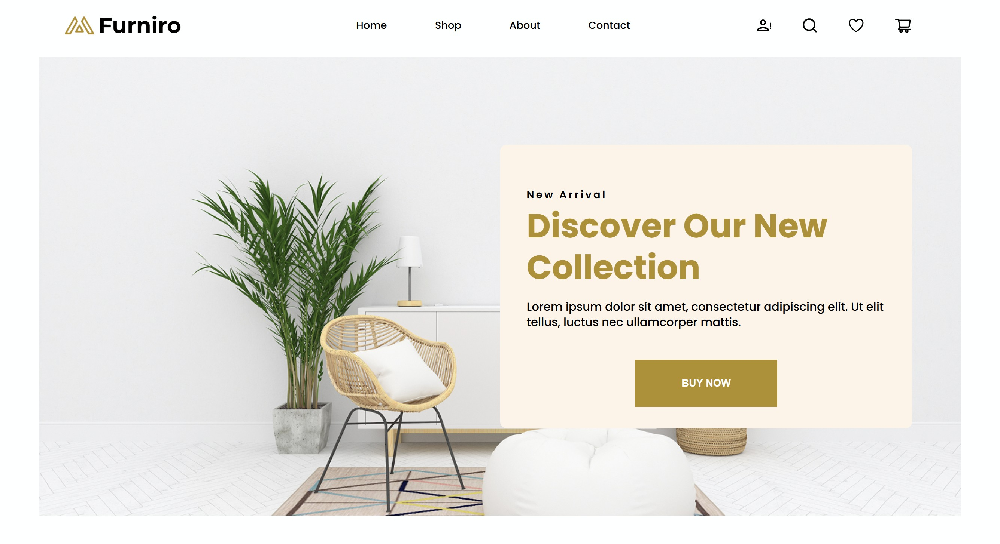
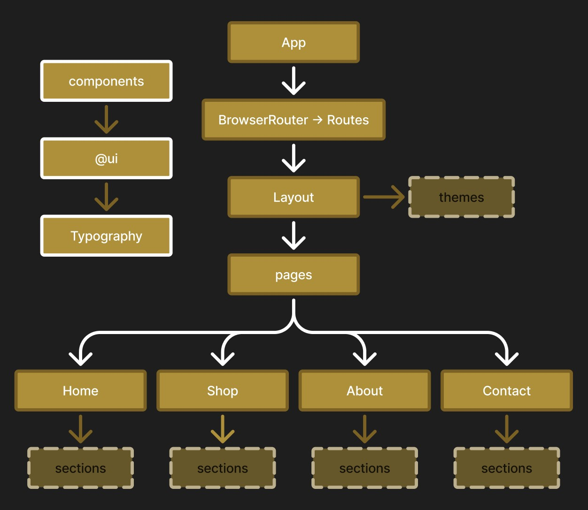

<h1 align = "center">Furniture Site Implementation</h1>

<p align = "center"><b>Overview</b>: This project is a Front-End Design System Implementation, of a Community Figma Design created by <i>aashifasheikh12</i>.</p>

<div align = "center">
  
</div>

<br>
<p align = "center">ℹ Note: Current scope is restricted to the Landing Page. Optimised for small desktops and above.</p>

------------

<h2>Table of Contents</h2>

- [Deployment](#deployment)
- [Installation](#installation)
- [Goals](#goals)
- [Tech Stack](#tech-stack)
- [Architecture](#architecture)
- [Components](#components)
- [Figma Reference](#figma-reference)
- [Process](#process)
- [Milestones](#milestones)
- [Future Milestones](#future-milestones)
- [Author](#author)

------------

# Deployment 

For a live demonstration, please feel free to view here: <br/>
https://furniture-site-implementation.vercel.app/

# Installation

```bash
npm install
npm run dev
```

# Goals
<i>Initially, this project was going to become a straightforward figma-to-code visual translation.

After setting my eyes on this public community figma design, which actually encompassed an entire 8 pages and a sidebar; it made sense to implement a scalable front-end system, with reusable components and design tokens. This would make it easier to create all the pages on this selfsame project.
</i>

# Tech Stack

<p align="left">
  <a href="https://skillicons.dev">
    
  </a>
    <h4><u>Packages:</u><br/><span style = "font-weight:lighter">classNames, react-router-dom, react-icons</span></h4>
</p>

# Architecture

This project consists of a Layout system, Typography system, Design Token variables associated to a main theme, a react-routing system, reusable grid & container classes, and reusable components.  

Styling is handled in modular css files and using hsl colouring only. Despite only having design files for desktop (therefore implementing 1440px view first), I'm utilising a mobile first mindset by allocating as much of the styling that requires a desktop width to be already handled by relevant media queries. Therefore when MS1 is complete, mobile styling properties will not be using media queries by default.

<h3>High level app flow diagram: </h3>

<div align= "center">
  
</div>


<h3> Layout </h3>

Folder & file structure: <a href="./docs/readme-assets/hierarchy.md">hierarchy.md</a>

- <i>Layout.tsx</i> - In addition to where the application layout is defined & the Outlet renders its child routes, it's also where the theme class is applied.
- <i>Layout.module.css</i> - Where the initial properties of the `grid`, `contentContainer` and `wideContainer` classes are established.
- <i>Themes.module.css</i> - Where all the design variable tokens for the default theme class reside.


# Components

<div align="left">

| Name  | Purpose                          | Used on                       |
| --------- | -------------------------------- | -------------------------------- |
| ProductCard      | Cards that are dynamically generated from the products.data.ts set. Optional stickers are also handled here as they do not appear outside of these cards.     | Home, Shop*, Single Product* |
| @ui/ShowMoreButton    | Button that complements the sections where ProductCard is present. Non-functional.      | Home, Shop* Single Product*                       |

*<i>Pages that are not currently implemented.</i>

</div>


# Figma Reference 

<b>Home</b>: <a href="./docs/readme-assets/figma-screenshots/figma-home-full.jpg">Full</a> | <a href="./docs/readme-assets/figma-screenshots/figma-home-layout-grid.jpg">Layout Grid</a> | Close ups: <a href="./docs/readme-assets/figma-screenshots/figma-home-pt1.jpg">Pt1</a> | <a href="./docs/readme-assets/figma-screenshots/figma-home-pt2.jpg">Pt2</a> | <a href="./docs/readme-assets/figma-screenshots/figma-home-pt3.jpg">Pt3</a>

Figma links can also be provided upon request.

# Process

This is written per pull request. As it's quite lenghty, I have divided this section into smaller files accessible by links below:

<b>Preparation & Initialisation:</b><br/>
Project initialisation to systems implementation: <a href="./docs/readme-assets/process-init-pr8.md">Init-#PR8</a>

<b>Figma translations with implementation decisions:</b><br/>
From the initial skeleton to translating the <i>Home</i> page from figma: <a href="./docs/readme-assets/process-pr9-15.md">#PR9-#PR15</a>

<b>Site responsiveness:</b><br/>
Making the site responsive for all desktop sizes: <a href="./docs/readme-assets/process-pr16.md">#PR16</a>

# Milestones

<h3><b>MVP</b> - Completed: 2026/03/26</h3>

- Front-End Architecture Implemented: Layout System, Typography System, Page Routing 
- Default theme implemented with associated design token variables
- Layout (Header and Footer) fully styled
- All Home sections visually styled for the original 1440px Figma design, using media queries where appropriate
- Carousel & ProductCard components that dynamically populate based on the accompanying data file

<h3><b>MS1</b> - In Progress</h3>

- [x] Better responsiveness on smaller desktop widths: Using appropriate breakpoints, including adjusting grid spans and pushing other flexed content where necessary
- [ ] Add responsiveness for all mobile devices
- [ ] Add placeholder 'coming soon' sections for linking pages that are yet to be implemented
- [ ] Add the alternative ProductCard view when clicking on the card


# Future Milestones

<h3><b>MS2</b></h3>

- Implement another page from the figma design
- Ensure this page is fully responsive for all devices
- Implement an additional theme (so default is not the only theme class)

<br/>

# Author

Front-end Design System Implementation by Hannahry
<i></br><b>aka: </b>@Hannalysis</i>